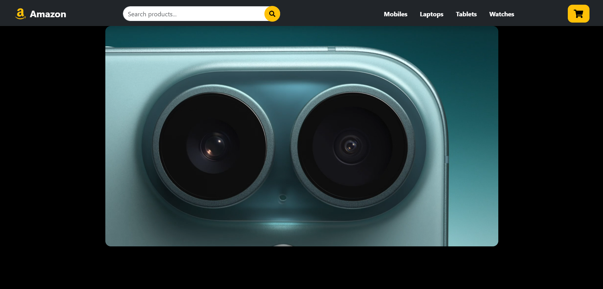
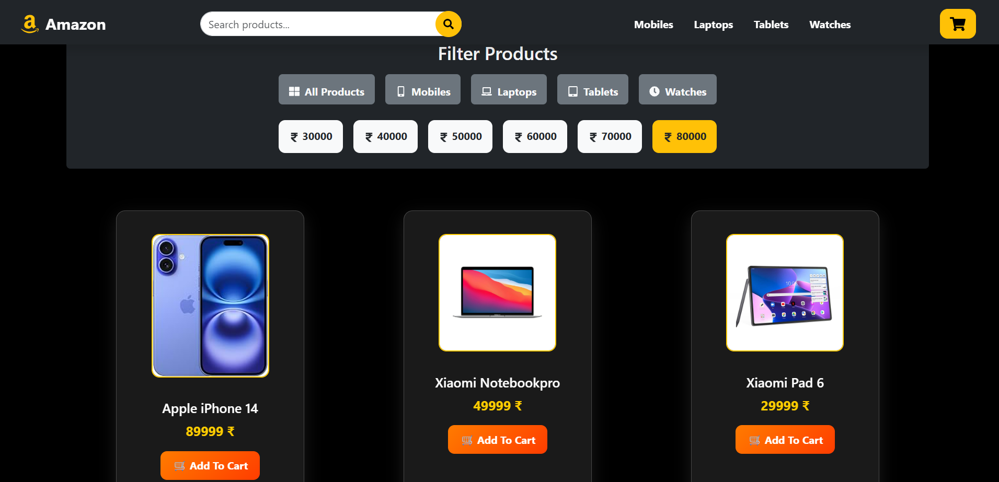
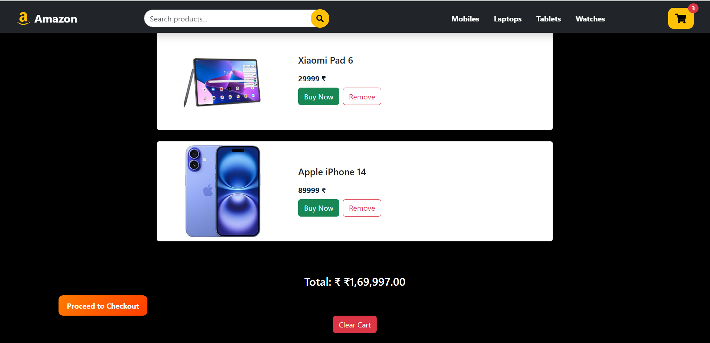

# 🛒 Amazon Clone UI - React.js

A front-end only Amazon Clone UI built using **React.js**.  
This project replicates the look and feel of the Amazon e-commerce interface with a clean, responsive design and essential UI elements. Ideal for learning front-end concepts, React components, and modern UI development.

## 🚀 Features

- 🔹 Responsive layout (mobile, tablet, desktop)
- 🔹 Navigation bar with logo, search bar, and cart
- 🔹 Product listing grid
- 🔹 Product detail cards
- 🔹 Add to cart (UI only)
- 🔹 Reusable components
- 🔹 Clean folder structure and modular code

## 🧱 Tech Stack

- ⚛️ **React.js**
- 💅 **CSS / Tailwind CSS** *(based on your actual usage)*
- 📦 **React Icons**
- 🧠 Functional components & hooks

## 📸 Screenshots

| Home Page | Product Grid | Product Card |
|-----------|---------------|--------------|
|  |  |  |

*(Add your actual screenshot files in a `screenshots/` folder)*

## 📂 Folder Structure

Amazon-Clone-UI/
├── public/
├── src/
│ ├── components/
│ ├── pages/
│ ├── assets/
│ └── App.js
├── package.json
└── README.md

bash
Copy
Edit

## 🛠️ Setup Instructions

```bash
# Clone the repository
git clone https://github.com/your-username/amazon-clone-ui.git

# Navigate into the project folder
cd amazon-clone-ui

# Install dependencies
npm install

# Start the development server
npm start

🌐 Live Demo 
🔗 Live Site
📁 GitHub Repository

👨‍💻 Author
Gautam Kumar Jha
📧 Email
🌐 Portfolio
🐙 GitHub

📌 Disclaimer
This is a front-end clone made for educational purposes. It is not affiliated with or endorsed by Amazon.

⭐️ Show your support
If you like this project, don't forget to ⭐️ the repo and share it with your friends!
